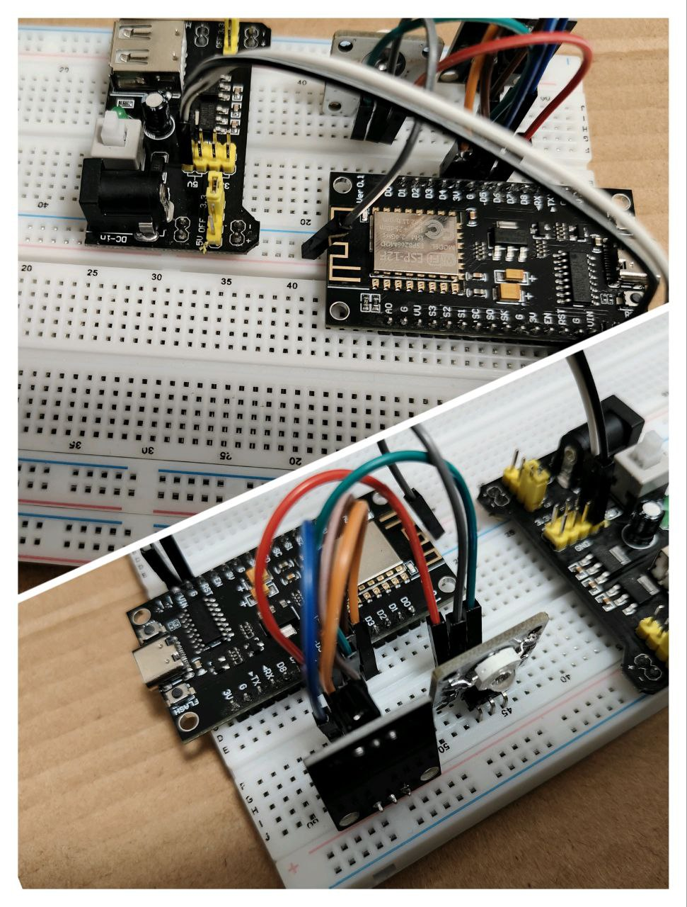

# TG-IRCS

使用Telegram机器人通过MQTT服务器与esp8266单片机通信，实现功能：
- 复制红外线，并持久化于闪存
- 定时定期定量执行红外指令
- 终止定时任务
- 可多用户使用Telegram机器人指令，需管理员认证
- 定期检测断网重连，更新网络时间

# 机器人指令
`/exec name [start] [freq] [remain]`
- `name`  
    - 执行命令，单片机校验不存在则执行失败
- `start`  
    - 指定执行开始时间，格式：
        - [Unix 时间戳](https://zh.wikipedia.org/wiki/UNIX%E6%97%B6%E9%97%B4)  
        - 指定日期`%Y-%m-%d/%H:%M:%S`  e.g. `2025-01-08/12:30:00`  
        - 延时时间`?d?h?m?s` e.g. `1d2h3m4s` 1天2时3分4秒后执行  
    - 小于当前时间则立即执行并更新为当前时间  
    - 默认 `0`
- `freq`  
    - 执行频率，格式：
        - 非负整数，单位秒  
        - 模式`?d?h?m?s` e.g. `1d2h3m4s` 每隔1天2时3分4秒执行
    - 默认 `0`
- `remain`  
    - 剩余执行次数  
    - 默认 `1`
    
`/terminate id`  
- 终止编号为id的任务

`/copy name [old]`
- `name`  
    - 学习红外命令的名称  
    - 若`old`未指定
        - `name`已存在则更新`name`
        - `name`已存在则从剩余容量中分配，容量已满（默认 8）则轮转覆盖。
- `old`  
    - 替换旧命令，单片机校验旧命令不存在则执行失败  
    - 默认 `""`

`/tasklist`  
- 当前所有任务信息

`/taskidlist`  
- 当前所有任务id

`/task id`  
- 获取编号为id的任务信息

`/cmdlist`  
- 当前学习的命令

`/adduser`  
- 添加可使用机器人指令的用户

`/auth`  
- 向管理员认证，申请使用指令


# 部署
## 机器人部署
### 环境
* 梯子
* `Python 3.12.4`
### 步骤

**配置环境变量**
```shell
cp .env.template .env
```
修改`.env`内配置  
- `IR_BOT_TOKEN` TG找机器人[@BotFather](https://t.me/BotFather)创建机器人，然后生成。
- `IR_MQTTHOST` MQTT服务器
- `IR_MQTTPORT` MQTT服务器端口
- `IR_SUB_TOPIC` MQTT消息发布主题，对应单片机上的订阅主题
- `IR_PUB_TOPIC` MQTT消息订阅主题，对应单片机上的发布主题
- `IR_USERNAME` MQTT用户名
- `IR_PASSWORD` MQTT密码
- `IR_ADMIN_CHAT` 管理员TG用户的id，你的id可通过机器人[@userinfobot](https://t.me/userinfobot)获取。或者先不填，在本机器人运行后输入任意指令可在控制台找到。


**下载依赖**
``` shell
pip -r requirements.txt
```
**运行机器人**   
~~请确保控制台有梯子~~
``` shell
python tg.py
```

## esp8266部署
### 环境
* esp8266NodeMCU单片机
* Arduino IDE
### 步骤

1. 修改`IR.ino`
    ``` c
    const char* MQTTSERVER="xxx"; //设置MQTT服务器IP地址
    const int MQTTPORT=xxx;  //设置MQTT服务器端口
    const char* MQTTUSER="xxx";  //设置MQTT用户名
    const char* MQTTPW="xxx";  //设置MQTT密码
    const char* PUBTOPIC="xxx"; //设置发布主题
    const char* SUBTOPIC="xxx";  //设置订阅主题
    ```
2. 编译烧录
3. 配置WiFi  
    - 设备启动时自动配网  
    如果设备保存了之前的 WiFi 信息且能成功连接到 WiFi，则跳过 AP 模式，直接运行程序。否则启动 AP 模式：设备开启一个热点（默认 SSID 为 `ESP8266_AP`，密码为 `12345678`）。连接到热点后，访问 `192.168.4.1` 打开配置页面。在配置页面中，选择附近的WiFi网络，并输入对应密码。如果连接成功，设备将保存配置信息；如果连接失败，将重启。  
    - 设备运行时主动配网  
    在设备运行中按下flash键，启动AP模式配网。
    - 自动配网或主动配网时会长亮LED，连接成功会闪烁4下，否则将重启设备。
    - 在设备运行中断开WiFi，将定期尝试重连之前的WiFi。  
    